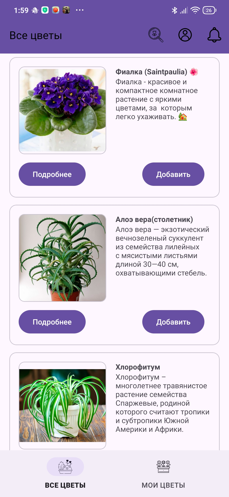
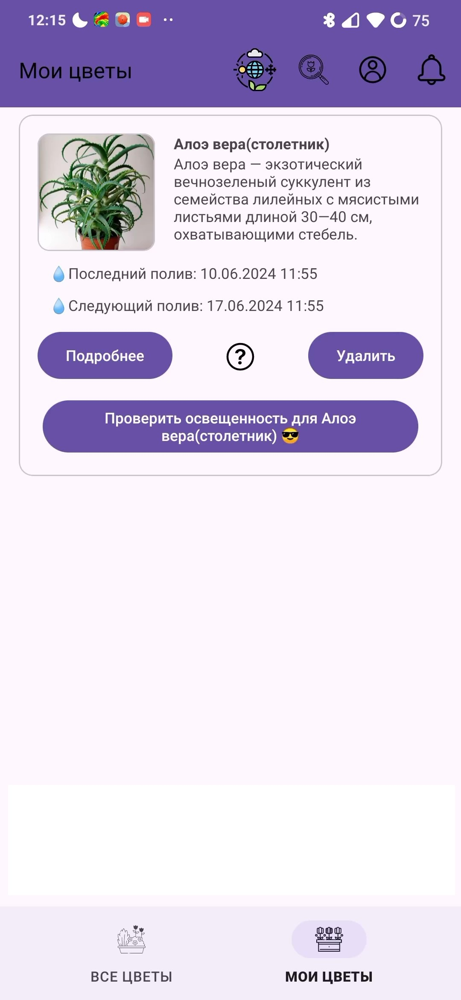
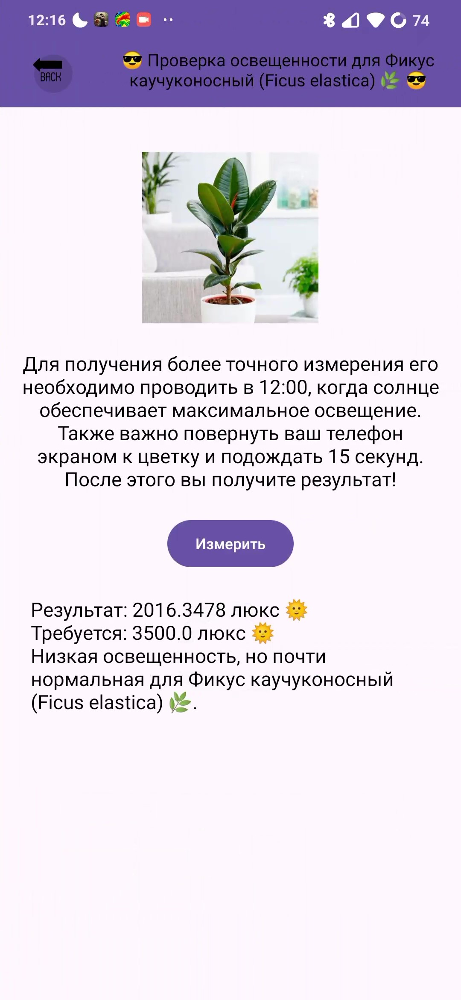
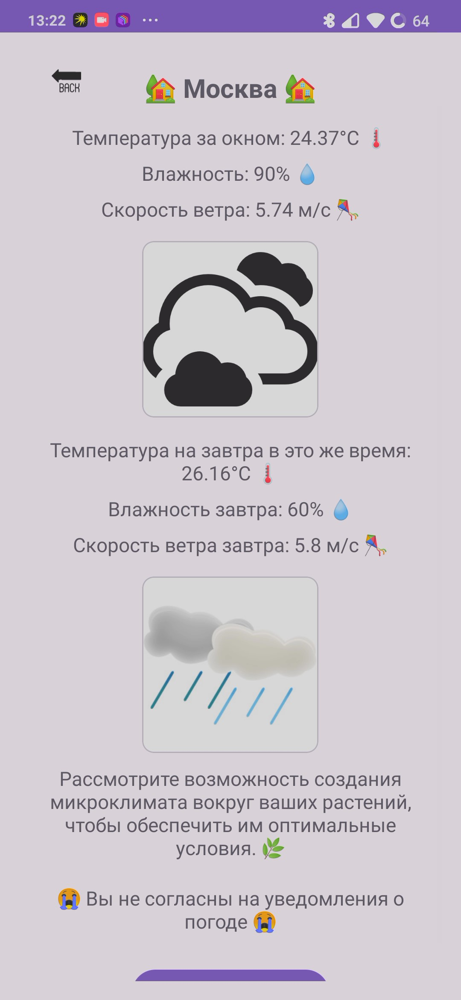

# Your_Velociraptor_Flowers

**Your_Velociraptor_Flowers** — это мобильное приложение для управления растениями, которое помогает пользователям отслеживать полив своих растений и получать напоминания о необходимости полива. Приложение использует Firebase для аутентификации пользователей и хранения данных о растениях.

## Функциональные возможности

- **Добавление растений**: Пользователь может добавить новое растение, указав дату и время последнего полива.
- **Удаление растений**: Пользователь может удалить растение из списка.
- **Отслеживание полива**: Приложение отображает даты последнего полива и следующие даты полива для каждого растения.
- **Напоминания о поливе**: Приложение вычисляет даты следующих поливов на основе последнего полива и заданного коэффициента полива.
- **Измерение уровня освещенности**: Приложение вычисляет уровень освещенности за счёт телефона.
- **Совет дня**: Приложение присылает совет дня за счёт погоды за окном.
- **Поиск по занванию**: Приложение способно найти растение по названию.
- **Синхронизация на разных устройствах**: приложение способно синхронизировать данные с разных устройств.
## Технологии

- **Firebase Authentication**: Обеспечивает безопасную аутентификацию пользователей.
- **Firebase Firestore**: Надежное и масштабируемое облачное хранилище данных.
- **DatePickerDialog и TimePickerDialog**: Удобный выбор даты и времени для полива.
- **Work-runtim**: Для постоянного обновления основного уведомления с растениями и прихода уведомления о поливе и совете дня.
- **Okhttp**: Парсинг «open weather map api» для совета дня.
- **Glide**: Загрузка фото по ссылке.
## Скриншоты

| Все цветы  | Мои цветы  |
|:---:|:---:|
|  |  |

| О цветке  | Стартовое окно  |
|:---:|:---:|
|  |  |

| Профиль после авторизации   | Статистика аккаунта  |
|:---:|:---:|
|  |  |

| Проверка освещённости  | Запрос на согласие на совет дня по погоде  |
|:---:|:---:|
|  |  |

| Погода и совет дня  | Уведомления  |
|:---:|:---:|
|  |  |

## Контакты

- **Автор**: Панкин Серафим Дмитриевич
- **Email**: [serafimpankin@yandex.ru](mailto:serafimpankin@yandex.ru)
- **GitHub**: [Popygai4ik](https://github.com/Popygai4ik)

---
